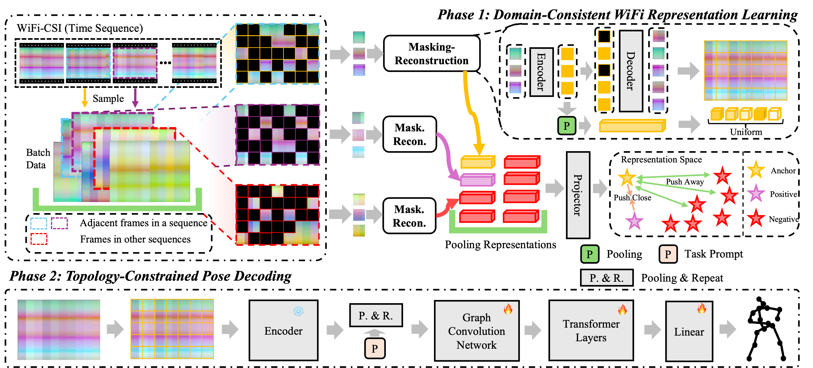

# DT-Pose

This repo is the official implementation for [Towards Robust and Realistic Human Pose Estimation via WiFi Signals](https://arxiv.org/abs/2501.09411).

## Framework



## Data Preparation

### Download datasets.

#### There are 3 datasets to download:

- MM-Fi Dataset
- WiPose Dataset
- Person-in-WiFi-3D Dataset

#### MM-Fi Dataset

1. Request dataset [here](https://ntu-aiot-lab.github.io/mm-fi)
2. Download the WiFi datasets:
   1. `MMFI_Dataset.zip`
   2. `MMFI_action_segments.csv`
3. Unzip all files from `MMFI_Dataset.zip` to `./data/mmfi/dataset` following directory structure:

```
- data/
  - mmfi/
    - dataset/
      - E01/
        - S01/
          - A01/
            - rgb/
            - mmwave/
            - wifi-csi/
              ...
```

#### WiPose Dataset

1. Request dataset [here](https://github.com/NjtechCVLab/Wi-PoseDataset)
2. Unzip all files from `Wi-Pose.rar` to `./data/wipose/` following directory structure:

```
- data/
  - wipose/
    - Train/
    - Test/
              ...
```

3. generate the amplitude data.

```
python process.py
```

#### Person-in-WiFi-3D Dataset

1. Request dataset [here](https://aiotgroup.github.io/Person-in-WiFi-3D/)
2. Unzip all files from `wifipose_dataset.zip` to `./data/person_in_wifi_3d/` following directory structure:

```
- data/
  - person_in_wifi_3d/
    - train_data/
    - test_data/
```

3. generate the amplitude and phase data.

```
python process.py
```


## Phase1: Pre-training

### Training MM-Fi dataset

```
python pretrain.py --config_file config/mmfi/pretrain_config.yaml
```

### Training Person-in-WiFi-3D dataset

```
python pretrain.py --config_file config/person_in_wifi_3d/pretrain_config.yaml
```

### Training WiPose dataset

```
python pretrain.py --config_file config/wipose/pretrain_config.yaml
```

## Phase2: Pose Decoding

### Training and testing MM-Fi dataset

```
python train_pose.py --config_file config/mmfi/pose_config.yaml
```

### Training and testing Person-in-WiFi-3D dataset

```
python train_pose.py --config_file config/person_in_wifi_3d/pose_config.yaml
```

### Training and testing WiPose dataset

```
python train_pose.py --config_file config/wipose/pose_config.yaml
```

## Acknowledgements

This repo is based on [MAE](https://github.com/IcarusWizard/MAE) and [MetaFi++](https://github.com/pridy999/metafi_pose_estimation). The data processing is borrowed from [MM-Fi](https://github.com/ybhbingo/MMFi_dataset) and [Person-in-WiFi-3D](https://github.com/aiotgroup/Person-in-WiFi-3D-repo). The baseline methods are from [HPE-Li](https://github.com/Toandinh1/ECCV24_Li-HPE) and [MetaFi++](https://github.com/pridy999/metafi_pose_estimation).

Thanks to the original authors for their work!


## Citation

Please cite this work if you find it useful:.

```
@article{chen2025towards,
  title={Towards Robust and Realistic Human Pose Estimation via WiFi Signals},
  author={Chen, Yang and Guo, Jingcai and Guo, Song and Zhou, Jingren and Tao, Dacheng},
  journal={arXiv preprint arXiv:2501.09411},
  year={2025}
}
```
